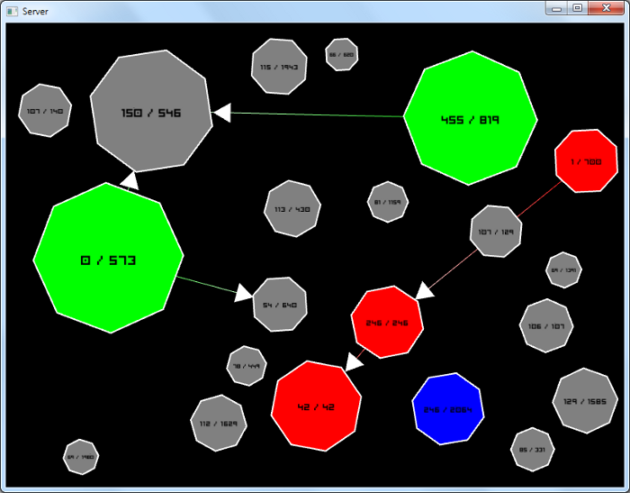

domnetwork
==========

A simple strategy game playable over a network, using TCP and UDP protocol.

You own an cell with a certain amount of units and you can make link between others cells to spread your color.

# Controls : 
* a left click from a cell to another : make a link
* a left second click from a cell to another which is already linked : erase the link
* a right click from a cell to another already connected : make an other type of link
* a right click from a cell to the same cell erase all links from this cell

# How to build

Get [SFML2.0](http://sfml-dev.org/)

Link width -lsfml-network -lsfml-graphics -lsfml-window -lsfml-system

By default the port used by the game are 53000 and 54000 (defined at the bottom of Client.h)

# Screenshot

